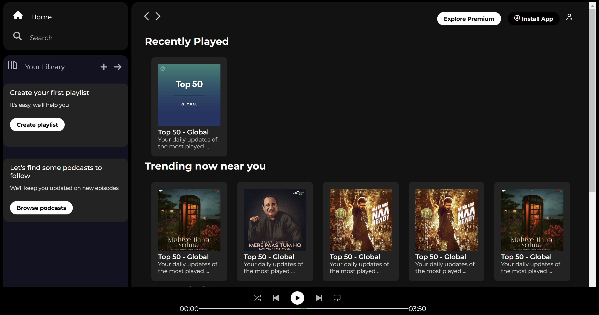

# Spotify Clone CSS

This project is a clone of the Spotify web player interface, created using HTML and CSS. The goal of this project is to replicate the look and feel of Spotify's web player, focusing on the layout, design, and responsiveness.

## Technologies Used

- HTML
- CSS
- Font Awesome (for icons)
- Google Fonts (for custom fonts)

## Features

- **Responsive Design**: The layout adjusts to different screen sizes, ensuring a good user experience on both desktop and mobile devices.
- **Sidebar Navigation**: A sidebar with navigation options for Home, Search, and Your Library.
- **Main Content Area**: Displays recently played songs, trending music, and featured charts.
- **Music Player**: A fixed music player at the bottom of the screen with playback controls and a progress bar.

## File Structure

- `images/`: A directory containing images used in the project.
- `index.html`: The main HTML file that contains the structure of the web page.
- `README.md`: This file, providing an overview of the project.
- `styles.css`: The CSS file that contains all the styles for the project.

## How to Run

1. Clone the repository to your local machine.
2. Open the project folder in Visual Studio Code.
3. Open `index.html` in your browser or use the Live Server extension in VS Code to view the project.

## 📸 **Screenshots**  
  

This project is a great way to practice HTML and CSS skills and to understand how to structure and style a complex web page layout.